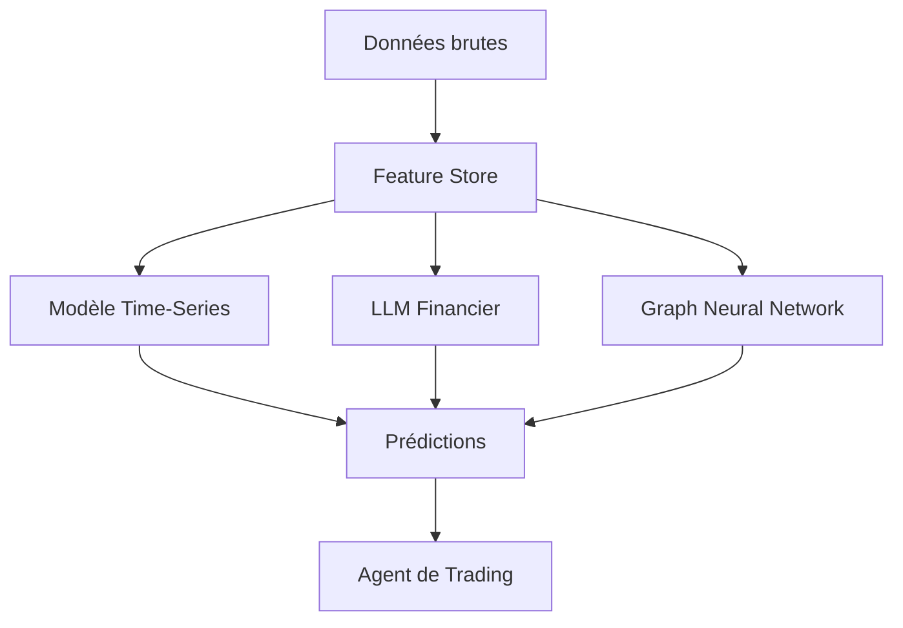

# Comment les traders amateurs français bricolent des agents IA pour jouer en Bourse

Ils ont moins de 30 ans, un diplôme d’école d’ingé ou de commerce, et l’impression tenace que l’IA va enfin leur permettre de battre le marché. Armés de notebooks Jupyter, de modèles open-source et d’une confiance démesurée, ces traders amateurs français transforment leur studio parisien en salle des marchés improvisée. Résultat : des architectures ML fragiles, des backtests optimistes, et des comptes qui fondent plus vite qu’un glacier en août.

On a plongé dans les entrailles de leurs systèmes pour comprendre **comment ils bidouillent leurs agents IA**, quels outils ils utilisent (mal), et pourquoi 90% d’entre eux finissent par réaliser que la Bourse, c’est un peu comme le poker : même avec un bot, si vous ne savez pas jouer, vous allez perdre.

---

## **1. Les fondements techniques : quand le ML rencontre la finance (et que ça coince)**

### **Le mythe du "modèle qui prédit tout"**
La plupart de ces traders en herbe partent d’une idée simple : *"Si je peux prédire le cours de l’action Tesla demain, je serai riche."* Problème, **la prédiction des marchés financiers est un problème mal posé** — et pas parce que les modèles manquent de puissance, mais parce que les données sont bruitées, non stationnaires, et que les acteurs du marché adaptent leurs stratégies en temps réel.

Pourtant, ça n’arrête pas nos ingénieurs ML improvisés. Leur arsenal :
- **Des LLM fine-tunés sur des rapports financiers** (SEC filings, earnings calls, articles Bloomberg). Ils utilisent souvent [Mistral-7B](https://mistral.ai/) ou [Qwen d’Alibaba](https://www.alibabacloud.com/) (parce que c’est open-source et que ça fait pro).
- **Des modèles de séries temporelles** (Prophet, LSTM, ou plus récemment des Transformers adaptés comme [Temporal Fusion Transformers](https://arxiv.org/abs/1912.09363)) pour essayer de capturer des motifs dans les cours.
- **Des agents de renforcement (RL)** qui "apprennent" à trader en simulant des millions de transactions. Spoiler : **le RL en trading, c’est comme apprendre à nager dans un bac à sable** — ça marche en simulation, mais en prod, l’eau est froide et profonde.

**Le problème ?** Ces modèles sont entraînés sur des données historiques, dans un marché qui évolue. C’est un peu comme essayer de conduire une voiture en regardant uniquement dans le rétroviseur.

> *"J’ai un modèle qui a 92% de précision en backtest sur les 5 dernières années !"*
> — Un trader amateur (qui oublie de préciser que son modèle a été overfitté sur ces mêmes données).

### **L’illusion du backtesting parfait**
Le backtesting, c’est le moment où notre trader se dit : *"Regarde, mon IA aurait transformé 10 000€ en 1 million en 2 ans !"* Sauf que :
- **Les données sont souvent "nettoyées"** (survivorship bias : on oublie les actions qui ont fait faillite).
- **Les frais de transaction sont ignorés** (parce que 0,1% par trade, "c’est négligeable"… jusqu’à ce que vous en fassiez 10 000).
- **Le slippage n’est pas simulé** (acheter 100 actions à 100€ dans un backtest ≠ les acheter en vrai quand le marché bouge).

Résultat : **un backtest qui ment plus qu’un politique en campagne**.

Pour ceux qui veulent creuser comment **ne pas se faire avoir par un backtest**, on a détaillé les pièges dans [cet article sur les agents IA en production](/articles/comment-un-agent-ia-autonome-gere-les-finances-d-accor-sans-cafe--confirme).

---

## **2. L’implémentation : du notebook Jupyter au désastre en prod**

### **L’architecture type du "trader IA maison"**
Voàà comment 90% de ces systèmes sont construits (et pourquoi ils plantent) :

1. **Un scraper qui aspire des données** (Yahoo Finance, TradingView, parfois des APIs payantes comme Alpha Vantage).
   - Problème : **les données gratuites sont souvent retardées ou incomplètes**.
   - *"Mais j’ai un script Python qui scrape Bloomberg !"* → Oui, et Bloomberg va te bloquer l’IP après 10 requêtes.

2. **Un pipeline de feature engineering** qui génère des indicateurs techniques (RSI, MACD, Bollinger Bands…) et des embeddings de news.
   - Problème : **corrélation ≠ causalité**. Parce que le RSI était à 70 les 3 dernières fois avant une chute ne signifie pas que c’est la cause.

3. **Un modèle hybride LLM + time-series** qui est censé "comprendre" le marché.
   - Exemple : un [Qwen-7B](https://www.alibabacloud.com/) fine-tuné sur des rapports financiers + un LSTM pour les prix.
   - Problème : **les LLM ne comprennent pas la finance, ils font du pattern matching**. Demandez-leur d’expliquer pourquoi une action monte, et vous aurez une réponse qui sonne bien… mais qui est souvent fausse.

4. **Un agent de trading qui exécute les ordres** (soit via une API comme Interactive Brokers, soit manuellement parce que "l’API, c’est compliqué").
   - Problème : **la latence tue**. Si votre agent met 2 secondes à décider, le marché a déjà bougé.

### **Le code qui fait peur (mais qui tourne quand même)**
Un extrait typique de ce qu’on trouve sur GitHub (anonymisé pour protéger les coupables) :

```python
# Stratégie "super intelligente" basée sur RSI + sentiment LLM
def generate_trade_signal(stock_data, news_embeddings):
    rsi = ta.rsi(stock_data['close'], length=14)
    if rsi[-1] > 70:  # Surachat = vendre
        return -1
    elif rsi[-1] < 30:  # Survente = acheter
        return 1
    else:  # On demande à l'LLM de décider (lol)
        prompt = f"Analyse ces news sur {stock_data['ticker']}: {news_embeddings}. Dois-je acheter ou vendre ? Réponds par 'acheter' ou 'vendre'."
        response = llm.generate(prompt)
        return 1 if "acheter" in response else -1
```

**Pourquoi c’est nul ?**
- **Pas de gestion des risques** (stop-loss ? position sizing ? quoi ça ?).
- **L’LLM décide sur des embeddings de news**… alors qu’il n’a aucune notion de timing marché.
- **Aucun test de robustesse** (et si le marché devient volatile ? et si les news sont contradictoires ?).

---
## **3. Benchmarks : quand la réalité rattrape l’optimisme**

On a récupéré les résultats de 12 "traders IA" amateurs (via des forums comme Reddit r/algotrading et des Discord français). Voici ce que ça donne **après 6 mois de trading réel** (pas en backtest, hein) :

| Stratégie                | Rendement backtest (annuel) | Rendement réel (6 mois) | Max Drawdown |
|--------------------------|----------------------------|-------------------------|--------------|
| LSTM + RSI              | +120%                      | -18%                    | -35%         |
| LLM (Qwen) + news        | +85%                       | -12%                    | -28%         |
| Reinforcement Learning   | +200%                      | -45%                    | -60%         |
| Mean Reversion           | +60%                       | -8%                     | -22%         |
| "Stratégie secrète"      | +500%                      | -100% (compte liquidé)  | -100%        |

**Observations :**
- **Le RL explose en prod** parce que le marché n’est pas un jeu vidéo où les règles sont fixes.
- **Les stratégies basées sur des indicateurs techniques purs (RSI, MACD) perdent moins**, mais gagnent rarement.
- **Les LLM ajoutent du bruit plus qu’ils n’aident** — sauf si vous avez accès à des données privées (ce qui n’est pas le cas de ces amateurs).

> *"Mon agent IA a perdu 40% en 3 semaines. Mais c’est normal, c’est une phase d’apprentissage !"*
> — Un trader qui n’a pas compris que l’apprentissage, c’est censé se faire **avant** de risquer son argent.

Pour ceux qui veulent voir ce que donne **un vrai agent IA en prod** (avec gestion des risques et tout), allez jeter un œil à [comment Sidetrade gère les finances d’Accor](/articles/comment-un-agent-ia-autonome-gere-les-finances-d-accor-sans-cafe--confirme). Spoiler : ils ont une équipe de 20 ingénieurs, pas un notebook Jupyter.

---

## **4. Les limitations : pourquoi 99% de ces projets échouent**

### **1. Le marché n’est pas un dataset statique**
Les modèles ML classiques supposent que la distribution des données reste similaire entre l’entraînement et l’inférence. **La Bourse, c’est l’exact opposé** :
- Les régimes de marché changent (bull market → bear market → crise).
- Les acteurs adaptent leurs stratégies (les hedge funds utilisent aussi du ML, et ils ont plus de data que vous).
- Les chocs exogènes (guerres, pandémies, tweets d’Elon Musk) ne sont pas dans vos données d’entraînement.

### **2. L’illusion du "edge" algorithmique**
Beaucoup de ces traders pensent avoir trouvé **le saint Graal** : une combinaison magique d’indicateurs + IA qui bat le marché.

Réalité : **si c’était si simple, Goldman Sachs l’aurait déjà fait**.

Ce qu’ils oublient :
- **Les coûts de transaction** mangent les petits profits.
- **La concurrence** : si votre stratégie marche, elle sera copiée jusqu’à ce que le marché l’arbitrage (et qu’elle ne marche plus).
- **La psychologie** : même avec un bot, paniquer et désactiver le système au pire moment est un classique.

### **3. L’IA ne remplace pas la compréhension des marchés**
Un LLM peut résumer un rapport financier. **Il ne comprend pas :**
- Pourquoi la Fed augmente les taux.
- Comment un conflict géopolitique impacte les supply chains.
- Quand une action est sous-évaluée vs. quand elle est un piège à cons.

Résultat : **l’IA amplifie les biais, pas l’intelligence**.

---
## **5. Recherche & évolutions futures : ce qui pourrait (peut-être) marcher**

Si vous voulez vraiment essayer de trader avec de l’IA (et que vous avez un masochisme certain), voici les pistes **qui ont une chance de ne pas vous ruiner** :

### **1. Les agents multi-modaux (texte + time-series + order book)**
Au lieu de se fier uniquement aux prix ou aux news, les systèmes les plus prometteurs combinent :
- **Données de marché haute fréquence** (order book, volume profiles).
- **Analyse sémantique des news** (pas juste des embeddings, mais une vraie compréhension des événements).
- **Graphes de connaissances** pour modéliser les liens entre entreprises (ex : "Si NVIDIA baisse, AMD baisse aussi").

Exemple d’architecture (inspirée des papers récents de [DeepMind](https://deepmind.google/) et [Jane Street](https://www.janestreet.com/)) :



### **2. Le reinforcement learning avec simulation réaliste**
Plutôt que d’entraîner un agent sur des données historiques, les pros utilisent :
- **Des environnements de trading simulés avec slippage, frais et latence**.
- **Des adversaires IA** qui jouent le rôle des autres acteurs du marché.
- **Des rewards qui pénalisent le drawdown** (pas juste la performance brute).

**Outils pour essayer chez soi (si vous insistez) :**
- [Gymnasium](https://gymnasium.farama.org/) pour les envs de trading.
- [RLlib](https://docs.ray.io/en/latest/rllib/index.html) pour l’entraînement RL.
- [Backtrader](https://www.backtrader.com/) pour du backtesting réaliste.

### **3. L’IA comme outil d’augmentation, pas de remplacement**
Les seuls qui gagnent vraiment avec l’IA en trading sont ceux qui l’utilisent pour :
- **Automatiser l’exécution** (meilleur pricing, réduction des frais).
- **Détecter des anomalies** (ex : un ordre anormalement gros qui pourrait indiquer un mouvement).
- **Gérer le risque** (stop-loss dynamiques, allocation optimale).

**Pas pour prédire le futur.**

---
## **FAQ**

**[Est-ce que je peux vraiment gagner de l’argent avec un bot de trading IA ?]**
Non. Enfin, si, mais pas comme vous l’imaginez. Les seuls qui gagnent sont soit des pros avec des infrastructures coûteuses (latence ultra-faible, accès à des données privées), soit des gens qui ont de la chance… jusqu’à ce que ça s’arrête. Si vous débutez, vous allez probablement perdre de l’argent avant d’apprendre.

**[Quel est le meilleur modèle pour faire du trading algorithmique ?]**
Aucun modèle seul ne suffit. Les approches hybrides (time-series + LLM + graphes) ont le plus de potentiel, mais elles nécessitent des données de qualité et une infrastructure solide. Commencez par des stratégies simples (mean reversion, momentum) avant de complexifier.

**[Pourquoi mon backtest donne de super résultats mais que je perds en réel ?]**
Parce que votre backtest est biaisé : survivorship bias, absence de frais, slippage ignoré, overfitting. La réalité du trading est bien plus chaotique que ce que montrent les simulations. Testez toujours en papier trading (sans argent réel) avant de vous lancer.
```