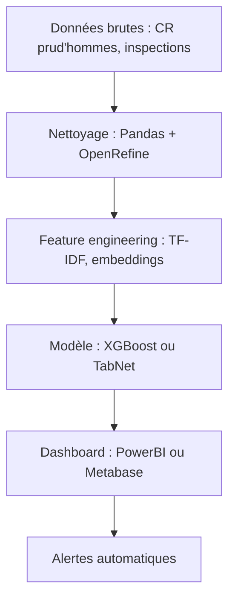

# Comment la CGT compte utiliser l’IA pour défendre les travailleurs (sans tout casser)

Quand la CGT annonce vouloir "intégrer l’intelligence artificielle" pour "renforcer l’unité syndicale", deux réactions possibles :
1. Un sourire en coin devant le buzzword bingo.
2. Une question légitime : **comment**, exactement ?

On va creuser la deuxième option. Parce que derrière les communiqués, il y a des choix techniques, des architectures possibles, et surtout des pièges à éviter. Spoiler : ce n’est pas parce qu’on colle "IA" sur un projet qu’il devient magique.

---

## Fondements techniques : l’IA syndicale, c’est quoi ?

### 1. Les cas d’usage (réalistes)
La CGT cite trois axes principaux :
- **Analyse automatique des conventions collectives** : extraire des droits, détecter des incohérences.
- **Veille juridique automatisée** : suivre les évolutions législatives et leurs impacts.
- **Communication interne** : synthétiser des comptes-rendus, générer des argumentaires.

Rien de révolutionnaire. Mais c’est déjà un défi technique.

**Pourquoi ?** Parce que les documents juridiques sont :
- **Non structurés** (PDF scannés, images de contrats).
- **Ambiguës** ("travail de nuit" peut avoir 12 définitions selon les branches).
- **Dynamiques** (une loi change, tout est à réanalyser).

### 2. Les briques technologiques nécessaires
Pour faire ça proprement, il faut :
- **Un pipeline OCR + NLP** : extraire le texte des PDF (Tesseract, EasyOCR) puis le structurer (spaCy, LayoutLM).
- **Un système de RAG (Retrieval-Augmented Generation)** : pour répondre aux questions en s’appuyant sur des sources fiables. [On en parle ici](/articles/comment-l-ia-apprend-a-parler-le-secret-du-mot-suivant--confirme).
- **Un fine-tuning de LLM** : parce qu’un modèle générique comme Mistral va halluciner des articles du Code du travail.

**Exemple concret** :
> *"Est-ce que mon employeur peut m’imposer des horaires décalés sans accord ?"*
→ Le système doit :
1. Extraire les clauses pertinentes de la convention collective.
2. Croiser avec le Code du travail (articles L3121-42 et suivants).
3. Générer une réponse **sourcée**, pas un délire de LLM.

---

## Implémentation : comment ça pourrait marcher (ou pas)

### Option 1 : Le "ChatGPT syndical" (spoiler : mauvaise idée)
Certains imaginent déjà un chatbot qui répond à toutes les questions. **Bonne chance avec ça.**

Problèmes :
- **Hallucinations** : un LLM peut inventer un article de loi. En droit du travail, c’est un risque juridique majeur.
- **Mise à jour** : les lois changent. Un modèle figé devient obsolète en 3 mois.
- **Explicabilité** : "Pourquoi cette réponse ?" → Si le système répond *"Parce que"*, c’est mort.

**Solution partielle** : un **RAG strict**, avec :
- Une base de données vectorielle (Weaviate, Qdrant) indexant **uniquement** des sources officielles (Legifrance, conventions collectives).
- Un prompt engineering agressif pour forcer le modèle à citer ses sources.

```python
# Exemple de prompt pour un LLM syndical
prompt = """
Tu es un assistant juridique spécialisé en droit du travail.
Réponds UNIQUEMENT en t'appuyant sur les documents suivants :
{context}

Question : {question}

Format de réponse obligatoire :
1. Réponse courte (max 3 lignes).
2. Sources précises (articles, alinéas).
3. Limites ou incertitudes.
"""
```

### Option 2 : L’automatisation des tâches répétitives
Moins sexy, mais plus utile :
- **Détection de clauses abusives** : un script qui scanne les contrats et flag les écarts par rapport à la loi.
- **Génération de courriers types** : pour les recours aux prud’hommes, avec des variables dynamiques (nom, dates, articles concernés).
- **Alertes législatives** : un crawler qui surveille le Journal Officiel et envoie des notifications ciblées.

**Stack technique possible** :
- **Backend** : FastAPI + PostgreSQL (pour stocker les conventions).
- **ML** : Un modèle de classification (BERT finetuné) pour détecter les clauses problématiques.
- **Frontend** : Un tableau de bord Streamlit pour les syndicats locaux.

**Coût estimé** :
- ~50k€ pour un MVP fonctionnel (sans compter la maintenance).
- ~200k€/an pour une solution scalable avec mise à jour automatique des lois.

### Option 3 : L’analyse de données massives (le vrai potentiel)
La CGT a accès à des montagnes de données :
- **Statistiques d’accidents du travail** (par secteur, par entreprise).
- **Données de négociation** (historique des augmentations, temps de travail).
- **Retours terrain** (signalements des délégués).

Avec ça, on peut :
1. **Prédire les risques** : quels secteurs vont avoir des conflits sociaux ? Quelles entreprises trichent sur les heures sup ?
2. **Optimiser les stratégies de négociation** : "Voici les arguments qui ont marché dans 80% des cas similaires."
3. **Dénoncer les abus** : croiser les données de l’INSEE avec les déclarations des entreprises.

**Exemple d’architecture** :


**Problème** : la CGT a-t-elle les compétences en interne pour gérer ça ? Et surtout, **a-t-elle les données propres et structurées** pour entraîner des modèles ?

---

## Benchmarks : ce qui existe déjà (et ce qui foire)

### 1. Les outils juridiques IA (état de l’art)
- **DoNotPay** : chatbot juridique grand public. **Problème** : limité aux cas simples, hallucinations fréquentes.
- **Casetext (acquis par Thomson Reuters)** : analyse de jurisprudence. **Coût** : 10k/an, hors de prix pour un syndicat.
- **Juriscan** (français) : recherche dans les décisions de justice. **Limite** : pas adapté au droit du travail.

### 2. Les initiatives syndicales existantes
- **UNI Global Union** utilise des outils de scraping pour surveiller les conditions de travail chez Amazon.
- **IG Metall (Allemagne)** a développé un chatbot pour les questions sur les conventions collectives. **Résultat** : 30% de réponses incorrectes, abandonné après 6 mois.

**Leçon** : sans **données propres + expertise métier**, l’IA syndicale devient un gadget.

### 3. Ce que la CGT pourrait faire (et devrait éviter)
| **À faire** | **À éviter** |
|--------------|--------------|
| Automatiser la veille législative | Croire qu’un LLM peut remplacer un juriste |
| Analyser les données internes (accidents, négociations) | Utiliser des modèles black-box sans audit |
| Former les militants à l’IA (pour qu’ils comprennent les limites) | Lancer un "ChatGPT syndical" sans garde-fous |

---

## Limitations : pourquoi ça va être compliqué

### 1. Le problème des données
- **Qualité** : les conventions collectives sont souvent en PDF mal scannés. OCR = cauchemar.
- **Droit d’auteur** : peut-on légalement scraper Legifrance pour entraîner un modèle ?
- **Biais** : si les données viennent surtout de grands groupes, le modèle sera biaisé contre les PME.

### 2. L’acceptation par les militants
Un outil IA qui dit à un délégué syndical :
> *"Ton argument sur les 35h n’est pas recevable, voici pourquoi"*

→ **Conflit garanti.** L’IA doit être un **assistant**, pas un juge.

### 3. La maintenance
- Les lois changent **tous les mois**. Qui met à jour le modèle ?
- Les conventions collectives sont **spécifiques à chaque branche**. Un modèle généraliste ne suffira pas.

**Coût caché** : une équipe de 3 ingénieurs ML + 2 juristes à temps plein, minimum.

---

## Recherche & évolutions futures : ce qui pourrait sauver le projet

### 1. Les agents IA spécialisés
Au lieu d’un gros modèle qui fait tout (mal), des **micro-agents** :
- Un agent "Conventions Collectives" (fine-tuné sur les textes de la métallurgie).
- Un agent "Prud’hommes" (entraîné sur les jurisprudences locales).
- Un agent "Négociation" (qui analyse les accords passés).

**Avantage** : moins de risques d’hallucinations, maintenance plus simple.

### 2. Le "Syndicat as a Service"
Pourquoi ne pas mutualiser avec d’autres organisations (Solidaires, FO) ?
- Une **base de connaissances commune**.
- Des **modèles partagés** (mais avec des accès contrôlés).
- Un **labo IA syndical** européen.

**Exemple** : [comment Airbus protège ses données sensibles avec de l’IA](/articles/comment-airbus-utilise-l-ia-pour-proteger-ses-secrets-comme-une-grand-mere-son-livre-de-recettes--confirme) → même principe, mais pour les droits des travailleurs.

### 3. L’IA "low-tech"
Parfois, **moins c’est mieux** :
- Un **moteur de recherche sémantique** (pas de génération, juste de la recherche augmentée).
- Des **alertes par SMS** basées sur des règles simples (ex : "Si température &gt; 30°C dans l’usine → alerte").
- Un **système de tagging collaboratif** (les militants annotent les documents, le modèle apprend par feedback).

**Coût** : 10x moins cher qu’un LLM custom. **Efficacité** : souvent supérieure.

---

## FAQ

**[La CGT peut-elle vraiment utiliser l’IA sans violer le RGPD ?]**
Oui, mais sous conditions strictes : anonymisation des données personnelles, base légale claire (mission de service public), et droit d’opposition pour les salariés. Les données de santé (accidents du travail) sont particulièrement sensibles.

**[Quel modèle open-source serait le plus adapté pour un chatbot syndical ?]
Mistral-7B finetuné sur un corpus juridique français, couplé à un RAG avec Weaviate. Éviter les modèles trop gros (Llama 2 70B) : coût d’inférence prohibitif et risque d’hallucinations accru.

**[Combien de temps pour développer un outil utile ?]
6 mois pour un MVP (veille + analyse basique), 2 ans pour une solution robuste avec agents spécialisés. Le vrai défi n’est pas technique, mais **organisationnel** : faire collaborer juristes, militants et ingénieurs.
```