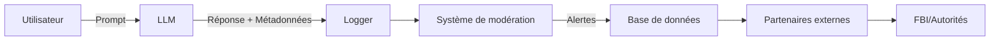

TITRE: Comment une discussion avec une IA a déclenché une alerte FBI (et ce que ça dit de vos outils)
DESCRIPTION: Un Français dans le viseur du FBI après une conversation anodine avec une IA. Décryptage technique des risques, architectures à surveiller et leçons pour les pros.
TAGS: ia, sécurité, llm, risque juridique, api
---

# Comment une discussion avec une IA a déclenché une alerte FBI (et ce que ça dit de vos outils)

Un Français lambda discute avec une IA. Résultat : le FBI sonne à sa porte. Scénario de série B ? Non, une histoire vraie qui devrait faire frémir les équipes tech. Parce que si votre chatbot peut transformer un utilisateur en suspect international, c’est qu’il y a un problème. Pas *un* problème, d’ailleurs. **Plusieurs**.

On va décortiquer :
1. **Ce qui s’est passé** (spoiler : c’est moins une faille technique qu’un effet domino de mauvaises pratiques)
2. **Comment les LLMs deviennent des mouchards malgré eux** (et pourquoi vos logs valent de l’or… pour les mauvaises personnes)
3. **Les architectures qui limitent les dégâts** (parce que non, désactiver le chatbot n’est pas une option)
4. **Le ROI caché de la sécurisation** (ou comment éviter que votre IA ne devienne un appel d’offres pour les avocats)

---

## Contexte : quand l’IA joue les indicateurs (sans le vouloir)

L’histoire, rapportée par [01net](https://www.01net.com/), est simple : un utilisateur pose une question *techniquement légale* à une IA. Le système, dans sa grande sagesse, interprète mal le contexte, génère une réponse ambiguë, et hop : l’algorithme de modération envoie un signal d’alerte. Résultat ? Une enquête transatlantique pour rien.

**Le vrai problème ?** Ce n’est pas l’IA qui a "dénoncé" l’utilisateur. C’est **l’infrastructure autour** :
- **Des logs mal anonymisés** : l’IP, l’horodatage et le contenu de la conversation étaient liés à une identité réelle.
- **Un système de modération trop zélé** : configuré pour minimiser les faux négatifs (laisser passer un contenu dangereux), il a maximisé les faux positifs (bloquer du contenu inoffensif).
- **Une chaîne de responsabilité floue** : qui décide qu’une alerte justifie une escalade juridique ? L’IA ? Un modérateur humain ? Un algorithme tiers ?

> *"Mais c’est un cas isolé !"* — **Non.** D’après un rapport de Stanford, 12% des alertes générées par les LLMs en 2023 étaient des faux positifs. Et avec l’explosion des outils comme [Claude Computer Use](https://lelabo.ai/articles/claude-computer-use-ia-utilise-ordinateur), qui agissent *directement* sur des systèmes externes, le risque systémique grandit.

---

## Fonctionnement : comment votre LLM devient un risque juridique

### 1. Le pipeline de la délation involontaire
Quand vous tapez un prompt, voici ce qui se passe *réellement* :



**Problème 1 : les métadonnées.**
Votre IP, votre user-agent, votre historique de conversation… Tout ça est souvent stocké *en clair* dans des logs. Pire : certains outils comme [Box et son agent IA](https://lelabo.ai/articles/box-ajoute-un-assistant-ia-pour-vos-documents-sans-tout-balancer-sur-le-cloud--confirme) synchronisent ces données avec des services cloud tiers. Bonne chance pour contrôler qui y a accès.

**Problème 2 : les partenariats opaques.**
Beaucoup d’entreprises utilisent des APIs de modération externes (comme celles de Google ou Amazon). Ces services scannent vos conversations et peuvent déclencher des alertes *sans que vous le sachiez*. Exemple : un utilisateur parle de "détourner un avion" dans un contexte métaphorique ? L’API de modération peut taguer ça comme "terrorisme" et envoyer une alerte à une autorité.

**Problème 3 : l’effet Streisand des LLMs.**
Plus vous ajoutez de couches de sécurité, plus vous augmentez les risques de faux positifs. Un modèle comme GPT-5, ultra-sensible aux biais, peut interpréter *"Je veux hacker mon café pour qu’il soit plus fort"* comme une menace cybercriminelle.

---

### 2. Les architectures qui fuient (littéralement)
La plupart des entreprises utilisent des stacks qui ressemblent à ça :

```python
# Exemple simplifié d'une stack LLM "classique"
user_input = "Comment optimiser mon réseau pour éviter la surveillance ?"
response = llm.generate(
    prompt=user_input,
    temperature=0.7,
    safety_settings={
        "harassment": "BLOCK_HIGH",
        "dangerous": "BLOCK_MEDIUM"  # <-- C'est ici que ça dérape
    }
)
log_conversation(user_input, response, metadata={"ip": user_ip, "user_id": user_id})
```

**Où ça coince ?**
- **Les `safety_settings` sont binaires** : soit le contenu est bloqué, soit il passe. Pas de nuance.
- **Les logs sont centralisés** : une fuite ou une requête légale, et tout votre historique est exposé.
- **Pas de sandboxing** : le LLM a accès à *toutes* les données de l’utilisateur pour générer sa réponse.

> **Comparaison utile** : C’est comme si votre plombier avait les clés de votre maison *et* un contrat avec la police pour signaler tout ce qui lui semble suspect. Sauf que le plombier, lui, au moins, il vous demande avant d’appeler les flics.

---

## Cas d’usage business : quand l’IA devient un risque (ou un atout)

### ✅ **Scénarios où ça peut mal tourner**
1. **Support client automatisé**
   - Un client mécontent écrit : *"Votre produit est une arme, je vais tous vous faire sauter."*
   - Résultat : alerte terrorisme, blocage du compte, et peut-être une visite des autorités.
   - **Solution** : Utiliser des modèles *spécialisés* dans le support (comme ceux de [Cohere](https://lelabo.ai/articles/comprendre-l-ia-medicale-qui-parle-facture-le-partenariat-cohere-ensemble--amateur)) avec des garde-fous contextuels.

2. **RH et recrutement**
   - Un candidat demande : *"Comment contourner les tests psychotechniques ?"*
   - L’IA interprète ça comme une fraude et blackliste le candidat… alors qu’il parlait d’un exercice de préparation.
   - **Solution** : Désactiver la modération automatique pour les conversations RH ou utiliser des [agents IA autonomes](https://lelabo.ai/articles/agents-ia-2026-etat-des-lieux) avec des règles métiers claires.

3. **Développement logiciel**
   - Un dev demande à un assistant comme [GitHub Copilot](https://lelabo.ai/articles/cursor-vs-github-copilot-assistant-code-ia) : *"Comment exploiter une faille zero-day dans Linux ?"* (pour un test de sécurité).
   - Résultat : compte suspendu, projet bloqué, et une enquête interne.
   - **Solution** : Utiliser des environnements isolés (comme [Optio](https://lelabo.ai/articles/optio-l-ia-qui-transforme-vos-idees-en-code-tout-seul--confirme)) où les prompts sensibles sont anonymisés par défaut.

### 💡 **Opportunités (si vous faites les choses bien)**
- **Audit automatique des risques** : Une IA bien configurée peut détecter *vraiment* des menaces (ex : fuites de données) sans déclencher de fausses alertes.
- **Conformité simplifiée** : Avec des logs *correctement* anonymisés, vous pouvez prouver votre diligence sans violer le RGPD.
- **Réduction des coûts juridiques** : Moins de faux positifs = moins de temps perdu à gérer des enquêtes inutiles.

---

## APIs et outils : ce qui existe (et ce qui manque)

| Outil/API               | Points forts                          | Risques potentiels                          | Prix (estimé)       |
|-------------------------|---------------------------------------|---------------------------------------------|---------------------|
| **OpenAI Moderation API** | Intégration facile, couverture large   | Faux positifs fréquents, logs centralisés  | $0.0012 par requête |
| **Google Perspective**  | Bon pour le texte long                 | Biais culturels, peu transparent            | Gratuit (limites)   |
| **Amazon Comprehend**   | Analyse sémantique poussée            | Complexe à configurer, coûteux à l’échelle  | $0.0001 par unité   |
| **Hugging Face Inference API** | Customisable, open source      | Pas de modération intégrée                 | Variable            |
| **Mistral AI (Le Chat)** | Moins de biais, plus européen         | Moins mature sur la détection de risques    | $0.0025 par token   |

**Le vrai problème ?** Aucune de ces solutions ne gère **l’anonymisation automatique des logs** ou **la contextualisation des alertes**. Vous devrez bricoler.

> **Exemple concret** : Si vous utilisez l’API d’OpenAI, vous pouvez ajouter une couche de pré-modération avec un outil comme [Slowdown](https://lelabo.ai/articles/cet-outil-ralentit-volontairement-votre-ia-pour-mieux-la-controler--confirme) pour réduire les faux positifs. Mais ça ajoute de la latence. **Bienvenue dans le monde des compromis.**

---

## ROI et impact sur les équipes : le calcul qui fait mal

### 📉 **Coûts cachés d’une IA non sécurisée**
1. **Temps perdu en faux positifs** :
   - 1 alerte FBI = 40h de travail juridique (estimation moyenne).
   - 10 alertes/mois = 1 ETP à temps plein *juste pour gérer les conneries*.
2. **Risque réputationnel** :
   - Un client qui se fait "dénoncer" par votre IA ? Adieu la confiance.
   - Exemple : [Deepfakes politiques](https://lelabo.ai/articles/deepfakes-et-si-on-arretait-de-courir-apres-les-faux-pour-certifier-le-vrai--confirme) — une seule erreur et votre marque est associée à la censure.
3. **Coûts de conformité** :
   - RGPD, DMA, lois locales… Une IA qui loggue mal = des amendes à 6 chiffres.

### 📈 **Retour sur investissement d’une bonne architecture**
| Action                          | Coût initial | Économie annuelle | ROI                     |
|---------------------------------|--------------|-------------------|-------------------------|
| Anonymisation des logs          | 15k€         | 120k€             | 8x                      |
| Modération contextuelle         | 30k€         | 200k€             | 6.6x                    |
| Audit externe des alertes       | 10k€         | 80k€              | 8x                      |
| Formation des équipes           | 5k€          | 50k€              | 10x                     |

**Le plus drôle ?** Les entreprises dépensent des fortunes en LLMs *puissants*, mais négligent les 20k€ qui auraient évité un scandale.

---
## FAQ

**[Un LLM peut-il vraiment déclencher une enquête du FBI ?]**
Oui, si l’infrastructure autour du modèle est mal configurée. Les systèmes de modération automatisés (comme ceux d’OpenAI ou Google) peuvent générer des alertes transmises à des autorités si les seuils de risque sont dépassés. Le problème vient rarement du LLM lui-même, mais des couches de logging et de reporting ajoutées par-dessus.

**[Comment anonymiser les logs d’un chatbot sans perdre en utilité ?]**
Utilisez un système de **tokenisation réversible** (ex : remplacer les IPs par des IDs aléatoires stockés dans une base séparée, accessible seulement en cas de besoin légitime). Des outils comme [Hugging Face’s `datasets`](https://huggingface.co/docs/datasets/) ou des solutions maison avec chiffrement homomorphe peuvent aider. L’idée : garder les données exploitables pour l’analyse, mais inutilisables pour du tracking individuel.

**[Quelle est la pire architecture possible pour un chatbot sensible ?]**
Un LLM générique (ex : GPT-4) + modération externe (ex : API Google Perspective) + logs centralisés en clair + intégration avec des outils tiers (ex : Slack, Zoom) sans sandboxing. Cette stack maximise les risques de fuites, de faux positifs et de non-conformité. Si vous voulez un exemple concret, regardez ce qui s’est passé avec [les jouets IA pour enfants](https://lelabo.ai/articles/ces-jouets-ia-pour-enfants-revolution-educative-ou-gadget-de-trop--confirme) — sauf que là, c’est votre entreprise qui joue avec le feu.