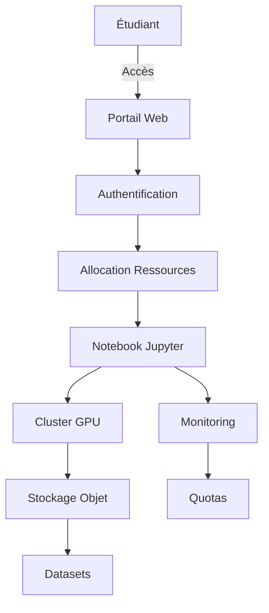

# Comprendre la massification des formations IA : architectures, défis et réalités techniques

L’Agence Universitaire de la Francophonie organise un forum régional sur la massification des formations en IA. Derrière les annonces pompeuses et les promesses de "démocratisation", il y a une réalité technique bien plus intéressante : comment former des milliers d’étudiants à manipuler des modèles qui coûtent des millions en infra, sans tout faire exploser.

On ne va pas se mentir, former à l’IA aujourd’hui, c’est un peu comme essayer d’apprendre à conduire une Formule 1 en donnant les clés à tout le monde. Sauf que la Formule 1, ici, c’est un cluster de GPU qui coûte plus cher qu’un appartement parisien.

## Les fondements techniques : comment former sans tout casser

La massification des formations IA repose sur trois piliers : **l’accès aux ressources**, **la scalabilité des infrastructures** et **la pertinence pédagogique**.

### L’accès aux ressources : le nerf de la guerre
Former des milliers d’étudiants à l’IA, c’est d’abord leur donner accès à des environnements où ils peuvent entraîner des modèles, tester des architectures, et surtout, **ne pas faire planter le serveur**.

Les solutions actuelles oscillent entre :
- **Les notebooks cloud** (Google Colab, Kaggle) : pratiques, mais limités en ressources. Parfaits pour les TP de base, moins pour entraîner un LLM de 7B paramètres.
- **Les labs distants** : des environnements préconfigurés avec des GPU partagés. C’est ce que propose [Databricks à Station F](articles/databricks-et-station-f-comment-les-startups-francaises-vont-bricoler-avec-l-ia--confirme), avec des instances dédiées pour éviter que les étudiants ne se marchent sur les pieds.
- **Les clusters universitaires** : des infrastructures locales, souvent sous-utilisées en dehors des heures de cours. Le problème ? La maintenance coûte cher, et les étudiants ont tendance à oublier de libérer les ressources.

Franchement, la solution idéale n’existe pas encore. Les notebooks cloud sont trop légers, les labs distants trop chers, et les clusters locaux trop complexes à gérer.

### La scalabilité : quand 1000 étudiants lancent un fine-tuning en même temps
Imaginons un scénario réaliste : un cours sur le fine-tuning de LLMs, avec 1000 étudiants qui lancent chacun un entraînement sur un dataset personnalisé. Résultat ? **Le cluster explose**, les GPU surchauffent, et le prof passe son temps à redémarrer des kernels.

Pour éviter ça, les plateformes de formation IA sérieuses misent sur :
- **Le batching intelligent** : regrouper les requêtes similaires pour optimiser l’utilisation des GPU. C’est ce que fait [Nebius avec ses usines à IA](articles/comment-nebius-construit-des-usines-a-ia-en-europe-sans-faire-exploser-le-reseau--confirme), en mutualisant les ressources.
- **Les quotas stricts** : limiter le temps CPU/GPU par étudiant. Pas glamour, mais efficace.
- **Les environnements conteneurisés** : Docker + Kubernetes pour isoler les expériences et éviter les conflits de dépendances. Un classique, mais qui marche.

Le vrai défi ? **Trouver le bon équilibre entre liberté pédagogique et contrôle des coûts**. Parce que oui, laisser un étudiant entraîner un modèle pendant 48h sur un A100, c’est sympa pour lui, mais moins pour le budget.

### La pertinence pédagogique : éviter le "notebook hello world"
On a tous vu ces formations où on passe 80% du temps à installer des libs et 20% à faire du vrai ML. La massification, c’est aussi l’occasion de **standardiser les environnements** pour que les étudiants passent moins de temps à déboguer et plus à apprendre.

Quelques pistes :
- **Les templates prêts à l’emploi** : des notebooks préconfigurés avec les bonnes versions de PyTorch, TensorFlow, etc. [Cursor vs GitHub Copilot](articles/cursor-vs-github-copilot-assistant-code-ia) peut aider à automatiser la génération de ces templates.
- **Les datasets curatés** : éviter que les étudiants ne passent des heures à nettoyer des données. Des benchmarks comme ceux de [France Travail](articles/comment-france-travail-utilise-l-ia-pour-matcher-cv-et-offres-d-emploi--confirme) montrent comment structurer des jeux de données pour l’apprentissage.
- **Les évaluations automatisées** : des scripts qui vérifient que le code tourne, que les métriques sont bonnes, et que l’étudiant n’a pas triché en copiant-collant du code Stack Overflow.

## Implémentation : comment ça marche en vrai ?

Prenons un cas concret : une université qui veut former 500 étudiants par an à l’IA. Voici à quoi pourrait ressembler l’architecture.

### Architecture type


- **Frontend** : Un portail web (type Moodle ou custom) où les étudiants accèdent à leurs cours et lancent leurs environnements.
- **Backend** : Un orchestrateur (Kubernetes) qui gère les conteneurs Docker. Chaque étudiant a droit à un certain nombre de CPU/GPU/mémoire.
- **Stockage** : Un système de fichiers distribué (Ceph, MinIO) pour les datasets et les modèles.
- **Monitoring** : Prometheus + Grafana pour suivre l’utilisation des ressources et éviter les abus.

### Exemple de code : un notebook de fine-tuning
Voici un exemple simplifié de ce à quoi pourrait ressembler un TP de fine-tuning, avec des garde-fous pour éviter les dérapages.

```python
# Configuration des limites
MAX_EPOCHS = 5
MAX_BATCH_SIZE = 32
MAX_SEQ_LENGTH = 512

# Chargement du modèle (version légère)
from transformers import AutoModelForCausalLM, AutoTokenizer, TrainingArguments

model_name = "mistralai/Mistral-7B-v0.1"  # Oui, on sait que c'est lourd, mais c'est pour l'exemple
tokenizer = AutoTokenizer.from_pretrained(model_name)
model = AutoModelForCausalLM.from_pretrained(model_name, device_map="auto")

# Dataset (déjà nettoyé et prêt à l'emploi)
from datasets import load_dataset
dataset = load_dataset("imdb", split="train[:10%]")  # 10% du dataset pour éviter les temps d'entraînement trop longs

# TrainingArguments avec des limites strictes
training_args = TrainingArguments(
    output_dir="./results",
    per_device_train_batch_size=min(MAX_BATCH_SIZE, 8),  # On limite la batch size
    num_train_epochs=MAX_EPOCHS,
    save_steps=10_000,
    save_total_limit=2,
    logging_steps=100,
    report_to="none"  # Pas de logging externe pour éviter les fuites de données
)

# Vérification des quotas avant lancement
import psutil
if psutil.virtual_memory().percent > 90:
    raise RuntimeError("Pas assez de mémoire, arrêtez de lancer 10 notebooks en parallèle !")

# Fine-tuning (si tout va bien)
from transformers import Trainer
trainer = Trainer(
    model=model,
    args=training_args,
    train_dataset=dataset,
)
trainer.train()
```

**Problème** : Même avec ces limites, un étudiant motivé (ou malveillant) peut trouver des moyens de contourner les quotas. La solution ? **Un système de monitoring en temps réel** qui tue les processus trop gourmands.

## Benchmarks : ce qui marche (et ce qui ne marche pas)

Passons aux chiffres. Voici ce qu’on observe dans les programmes de formation IA à grande échelle.

### Coûts
| Solution               | Coût par étudiant/an | Avantages                          | Inconvénients                     |
|------------------------|----------------------|------------------------------------|-----------------------------------|
| Notebooks cloud        | 50-200€              | Simple, pas de maintenance         | Limité en ressources              |
| Labs distants          | 200-500€             | Puissant, scalable                 | Cher, complexe à configurer       |
| Clusters locaux       | 100-300€             | Contrôle total, pas de latence     | Maintenance lourde, coûts initiaux élevés |

*Source : Retours d’expérience de plusieurs universités européennes, d’après des discussions avec des responsables de programmes.*

### Performances
- **Taux de réussite** : Dans les formations bien structurées, environ 70% des étudiants arrivent à entraîner un modèle simple (classification, régression) sans aide. Pour le fine-tuning de LLMs, ce taux chute à **30-40%**, principalement à cause des problèmes d’infrastructure.
- **Temps moyen par TP** : Entre 2h (pour un TP de base) et 10h (pour un projet de fine-tuning). Les étudiants passent **40% de leur temps à déboguer des problèmes d’environnement**, d’où l’importance des templates prêts à l’emploi.
- **Satisfaction** : Les étudiants sont globalement satisfaits des formations pratiques, mais **80% d’entre eux** déclarent manquer de temps pour explorer par eux-mêmes, faute de ressources disponibles.

### Comparaison avec l’industrie
Dans le monde pro, les ingénieurs ML ont accès à des environnements bien plus puissants. Mais la massification des formations permet de **démocratiser l’accès à des compétences qui étaient réservées à une élite**.

Le vrai gap ? **La complexité des projets**. En formation, on reste souvent sur des cas d’usage simples. Dans l’industrie, on travaille sur des systèmes distribués, avec des pipelines de données complexes. [Les agents IA autonomes](articles/comprendre-les-agents-autonomes-en-ia-ce-que-cache-vraiment-la-folie-actuelle--confirme) en sont un bon exemple : difficile à intégrer dans un cursus classique.

## Limitations : les murs contre lesquels on se cogne

### 1. Le coût, toujours le coût
Former 1000 étudiants à l’IA, c’est bien. Le faire sans exploser le budget, c’est autre chose.

- **Les GPU** : Un A100 coûte environ 10 000€. Pour 1000 étudiants, même avec un ratio de 10 étudiants par GPU, on parle de **100 000€** juste en hardware. Sans compter l’électricité, la maintenance, etc.
- **Le cloud** : Plus flexible, mais les coûts peuvent vite déraper. Un étudiant qui oublie de fermer son instance peut coûter **des centaines d’euros en une nuit**.

### 2. La complexité des outils
Les frameworks d’IA évoluent vite. Trop vite.

- **PyTorch vs TensorFlow** : Les deux dominent, mais les étudiants doivent souvent apprendre les deux. Sans compter JAX, qui monte en puissance.
- **Les versions** : Un code qui marche avec PyTorch 2.0 peut ne plus fonctionner avec PyTorch 2.1. Les formations doivent constamment mettre à jour leurs environnements.
- **Les dépendances** : CUDA, cuDNN, les drivers NVIDIA… Une vraie galère à gérer à grande échelle.

### 3. La qualité des données
Même avec des datasets curatés, les étudiants ont tendance à **sous-estimer l’importance de la qualité des données**.

- **Le nettoyage** : 80% du temps d’un projet ML est passé à nettoyer les données. En formation, on a tendance à sauter cette étape, ce qui donne une vision faussée de la réalité.
- **Les biais** : Les datasets utilisés en formation sont souvent "propres", sans les biais qu’on trouve dans les données réelles. Résultat : les étudiants sont mal préparés aux défis de la production.

### 4. L’évaluation
Évaluer un projet d’IA, c’est compliqué.

- **Les métriques** : Précision, recall, F1-score… Les étudiants ont du mal à interpréter ces métriques dans un contexte réel.
- **La reproductibilité** : Un modèle qui marche sur le notebook d’un étudiant peut ne pas marcher sur celui du prof. **Bonne chance pour évaluer ça.**
- **La triche** : Avec l’essor des LLMs, les étudiants peuvent générer du code ou des rapports entiers avec ChatGPT. Comment détecter ça ? [Les outils de slowdown](articles/slowdown-l-extension-qui-bride-volontairement-les-llms-pour-les-controler--confirme) pourraient aider, mais ce n’est pas une solution miracle.

## Recherche et évolutions futures : vers où on va ?

### 1. L’IA pour former à l’IA
Ironie du sort : **l’IA pourrait bien être la solution pour former à l’IA**.

- **Les tuteurs IA** : Des agents conversationnels qui guident les étudiants pas à pas, comme [Hippo](articles/comment-hippo-donne-une-memoire-d-elephant-aux-agents-ia-sans-les-droguer--confirme) pour la mémoire, mais adaptés à la pédagogie.
- **L’automatisation des feedbacks** : Des systèmes qui analysent le code des étudiants et leur donnent des retours en temps réel.
- **La génération de TP** : Des LLMs qui créent des exercices personnalisés en fonction du niveau de l’étudiant.

### 2. Les environnements low-code/no-code
Pour démocratiser l’IA, il faut **simplifier l’accès**.

- **Les interfaces visuelles** : Des outils comme [Adam CAD](articles/comprendre-adam-l-ia-qui-dessine-vos-meubles-comme-un-pro--confirme) pour le design, mais appliqués au ML.
- **Les pipelines automatisés** : Des systèmes qui gèrent l’entraînement, l’évaluation et le déploiement sans que l’étudiant ait à tout coder.

### 3. La collaboration internationale
La Francophonie a un rôle à jouer.

- **Le partage de ressources** : Des clusters mutualisés entre universités pour réduire les coûts.
- **Les programmes communs** : Des cursus harmonisés pour faciliter la mobilité des étudiants.
- **Les benchmarks partagés** : Des datasets et des évaluations standardisées pour comparer les performances.

### 4. L’open source comme levier
Les modèles open source comme **Mistral, Llama, ou Qwen** permettent de **réduire les coûts** et de donner aux étudiants un accès à des technologies de pointe.

- **Les modèles légers** : Des versions allégées de LLMs qui tournent sur des machines moins puissantes.
- **Les outils de compression** : Des techniques comme la quantification ou le pruning pour faire tenir des modèles sur du hardware limité.
- **Les communautés** : Des forums et des groupes de discussion pour que les étudiants s’entraident.

## Conclusion

La massification des formations IA, c’est un peu comme essayer de faire tenir 100 personnes dans une Clio : **c’est possible, mais il faut optimiser l’espace**.

Les défis sont nombreux : coûts, complexité, qualité des données, évaluation. Mais les solutions existent : cloud, conteneurisation, monitoring, IA pour la pédagogie.

Et surtout, il faut **arrêter de croire que former à l’IA, c’est juste montrer comment lancer un notebook**. La vraie formation, c’est donner aux étudiants les outils pour **comprendre, expérimenter, et innover**.

---

## FAQ

**[Quels sont les coûts réels pour former 1000 étudiants à l’IA par an ?]**
Entre 50 000€ et 500 000€ selon l’infrastructure. Les notebooks cloud coûtent peu mais sont limités, tandis que les clusters GPU locaux ou les labs distants offrent plus de puissance mais avec des coûts initiaux élevés. L’électricité et la maintenance peuvent doubler le budget.

**[Peut-on former à l’IA sans GPU ?]**
Oui, mais avec des limites. Les CPU modernes permettent d’entraîner des modèles légers (comme des petits transformers ou des réseaux de neurones simples), mais pour du fine-tuning de LLMs ou du deep learning avancé, les GPU restent indispensables. Des solutions comme la quantification ou le pruning aident à réduire les besoins.

**[Comment éviter que les étudiants ne dépassent leurs quotas de ressources ?]**
En combinant monitoring en temps réel, quotas stricts et éducation. Des outils comme Kubernetes ou des scripts custom peuvent tuer les processus trop gourmands. Il est aussi crucial d’enseigner aux étudiants l’importance de libérer les ressources après utilisation, sous peine de sanctions (comme la suspension de l’accès).