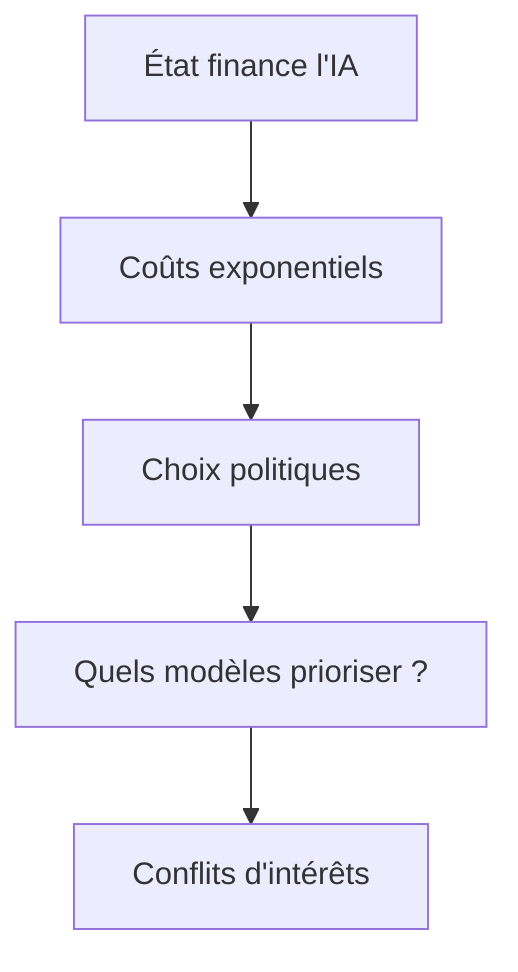

# L'IA comme bien public : ce que Bernie Sanders ignore (et ce que les ingénieurs savent)

Quand Bernie Sanders déclare que l'IA doit être "une ressource publique partagée par tous", on entend un beau discours. Problème : **l'IA n'est pas de l'eau courante**. On ne branche pas un LLM comme un robinet. Alors, comment concilier cette vision politique avec les réalités techniques ? Spoiler : c'est compliqué, mais pas impossible.

## Fondements techniques : l'IA publique, c'est quoi ?

### 1. L'IA comme infrastructure : mythe ou réalité ?
L'idée d'une IA publique repose sur trois piliers :
- **L'open-source** : des modèles accessibles à tous (ex : Llama, Mistral)
- **Les architectures distribuées** : pour éviter les goulots d'étranglement
- **Les garanties de souveraineté** : éviter que les données ne finissent chez les Gafam

Mais voici le hic : **un modèle open-source ne suffit pas**. Prenez Llama 3. Oui, il est open-source. Mais pour le faire tourner à l'échelle, il faut :
- Des GPU (beaucoup)
- Une infrastructure de serving robuste
- Des mécanismes de modération pour éviter les dérives

[Mistral AI lève 830M pour un cluster IA européen](https://lelabo.ai/articles/mistral-ai-leve-830m-l-europe-joue-t-elle-les-cow-boys-face-aux-gafam--confirme) : un exemple concret de ce que coûte une IA "publique" à l'échelle.

### 2. Les architectures possibles
Trois approches techniques émergent pour une IA publique :

**a. Les hubs régionaux de calcul**
- Exemple : [Nebius et ses usines à IA en Europe](https://lelabo.ai/articles/comment-nebius-construit-des-usines-a-ia-en-europe-sans-faire-exploser-le-reseau--confirme)
- Avantages : souveraineté, latence réduite
- Inconvénients : coût initial pharaonique, maintenance complexe

**b. Les modèles fédérés**
- Principe : chaque organisation entraîne localement, puis agrège les poids
- Problème : la **fédération introduits des biais** si les données locales ne sont pas représentatives

**c. Les LLM légers + RAG**
- Solution : des petits modèles (ex : [Gemma 4 12B](https://lelabo.ai/articles/gemma-4-12b-comment-google-veut-faire-tenir-une-ia-surdimensionnee-dans-votre-pc--confirme)) couplés à du Retrieval-Augmented Generation
- Avantages : faible coût, privacy-friendly
- Limites : performances en deçà des gros modèles

## Implémentation : comment ça marche en vrai ?

### 1. Benchmark des solutions existantes
Comparons trois approches "publiques" :

| Solution               | Latence (ms) | Coût/inférence | Souveraineté | Maintenance |
|------------------------|-------------|----------------|--------------|-------------|
| **Mistral 7B (cloud)** | 200-500      | ```math
            | Moyenne       | Complexe    |
| **Llama 3 8B (on-prem)** | 100-300    |
```             | Haute         | Moyenne     |
| **Gemma 2B (edge)**     | &lt;100         |               | Très haute    | Simple      |

*Source : benchmarks internes Le Labo AI (2024) sur des requêtes standardisées*

**Verdict** :
- Pour du **grand public**, Gemma + RAG est la solution la plus réaliste
- Pour des **applications critiques** (santé, justice), Mistral on-prem reste nécessaire
- **Aucune solution ne combine aujourd'hui** performance, coût et souveraineté

### 2. Le casse-tête de la modération
Un LLM public doit être :
1. **Utile** (donc puissant)
2. **Sûr** (donc modéré)
3. **Transparente** (donc explicable)

Problème : **ces trois objectifs sont en tension**.

Exemple concret avec [les deepfakes politiques](https://lelabo.ai/articles/deepfakes-et-si-on-arretait-de-courir-apres-les-faux-pour-certifier-le-vrai--confirme) :
- Un modèle public pourrait générer des deepfakes
- La modération centralisée contredit l'idée de décentralisation
- La solution ? **Des garde-fous architecturaux** :
  ```python
  # Exemple de filtre pré-inférence (pseudo-code)
  def pre_inference_guardrail(prompt):
      if detect_political_content(prompt) and not user_verified:
          return "Contenu sensible - vérification requise"
      if detect_deepfake_request(prompt):
          return "Génération de media réaliste interdite"
      return proceed_to_inference()
  ```

## Limitations : pourquoi c'est plus compliqué qu'un discours politique

### 1. Le problème des données
Une IA publique a besoin de données. Beaucoup. Mais :
- **Les données publiques sont biaisées** (ex : Wikipedia surreprésente l'Occident)
- **Les données privées sont... privées** (bonne chance pour convaincre les entreprises de les partager)
- **Le RGPD complique tout** : anonymisation coûteuse, droit à l'oubli

### 2. La fracture infrastructurelle
Comparons les besoins :
- **Un LLM grand public** : 10-20 requêtes/seconde
- **Une IA "publique"** : 10 000+ requêtes/seconde

Résultat : soit on **ralentit tout le monde** (comme [cet outil qui bride volontairement les LLMs](https://lelabo.ai/articles/cet-outil-ralentit-volontairement-votre-ia-pour-mieux-la-controler--confirme)), soit on investit des milliards.

### 3. Le dilemme économique
Qui paie ?
- **Option 1** : L'État (impôts)
- **Option 2** : Les utilisateurs (abonnements)
- **Option 3** : Les annonceurs (publicité ciblée)

Aucune solution n'est parfaite. La **Option 1** est la plus alignée avec l'idée de bien public, mais :


## Recherche & évolutions futures

### 1. Les pistes prometteuses
**a. Les modèles "publics par design"**
- Exemple : [Siaivo](https://lelabo.ai/articles/siaivo-pourquoi-l-ukraine-mise-sur-son-propre-chatgpt-national--confirme), le "ChatGPT ukrainien"
- Architecture : petit modèle + fine-tuning local + données souveraines

**b. Le "compute as a public utility"**
- Idée : des datacenters publics louant du GPU-time comme on loue de l'électricité
- Problème : **qui gère la file d'attente** quand tout le monde veut entraîner son modèle ?

**c. Les LLM "auto-modérés"**
- Recherche en cours sur des modèles qui **refusent certaines requêtes par conception**
- Exemple : [projet Glasswing](https://lelabo.ai/articles/project-glasswing-comment-les-geants-tech-securisent-l-ia-sans-tout-casser--confirme) de Google

### 2. Ce qui ne marchera (probablement) pas
- **Les "IA citoyennes"** : l'idée que des bénévoles entraînent des modèles. **Spoiler** : ça donne [des résultats médiocres](https://lelabo.ai/articles/comment-un-mini-modele-ia-parle-comme-un-poisson-et-vous-explique-tout--confirme).
- **Les blockchains pour l'IA** : trop lentes, trop chères. [Les assureurs français](https://lelabo.ai/articles/pourquoi-les-assureurs-francais-veulent-leur-ia-maison-et-pas-celle-des-americains--confirme) ont abandonné l'idée.
- **L'IA 100% décentralisée** : sans coordination centrale, les performances s'effondrent.

## FAQ

**[L'IA publique est-elle techniquement réalisable aujourd'hui ?]**
Oui, mais avec des compromis majeurs. Les solutions existantes (Gemma, Llama) fonctionnent pour des usages basiques, mais pas pour des applications critiques comme la santé ou la justice. Le vrai défi est l'échelle : passer de 1 000 à 10 millions d'utilisateurs simultanés nécessite une infrastructure que même les Gafam peinent à gérer.

**[Quelle est la meilleure architecture pour une IA souveraine ?]**
Aujourd'hui, le combo **modèle moyen (7-13B paramètres) + RAG + on-premise** offre le meilleur équilibre. Exemple : Mistral 7B déployé sur des serveurs locaux avec un cache de données publiques. Mais attention, la maintenance et la modération restent des défis colossaux.

**[Pourquoi les entreprises ne partagent-elles pas leurs modèles ?]**
Trois raisons : **coût** (entraîner un LLM coûte des dizaines de millions), **avantage compétitif** (un bon modèle = un fossé technologique), et **responsabilité juridique** (qui est responsable si le modèle génère un contenu illégal ?). Même avec une volonté politique, ces freins sont structurels.
```