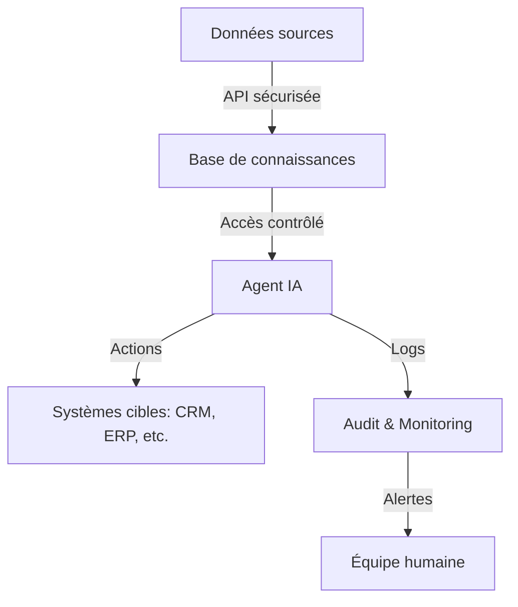

# Pourquoi vos agents IA vont droit dans le mur sans discipline data

On vous a vendu des agents IA autonomes capables de gérer vos finances, d’écrire du code ou de négocier avec vos fournisseurs. **Spoiler** : sans une discipline data digne d’un comptable suisse, ces petits génies numériques vont surtout exceller dans l’art de tout casser.

Les annonces marketing pullulent : *"Notre agent IA gère 80% de vos tâches répétitives !"* ou *"Automatisez votre entreprise en un clic !"*. Franchement, si c’était aussi simple, les DSI ne passeraient pas leurs nuits à éteindre des incendies. La réalité, c’est que ces agents ont besoin d’un écosystème data aussi bien huilé qu’un moteur de Formule 1. Sinon, vous obtenez l’équivalent numérique d’un stagiaire qui envoie un mail à toute la boîte en CC au lieu de CCI.

## Le problème : des agents IA qui improvisent comme des jazzmen bourrés

Un agent IA, c’est un peu comme un assistant ultra-compétent… **sauf qu’il n’a pas de mémoire à long terme, qu’il invente des réponses quand il ne sait pas, et qu’il peut décider de réorganiser votre base clients parce qu’il a "trouvé une meilleure façon de faire"**.

Prenons un cas concret : un agent chargé de gérer les remboursements clients. Sans règles strictes sur :
- **Les sources de données autorisées** (est-ce qu’il pioche dans le CRM, l’ERP, ou le tableur Excel oublié dans un coin ?)
- **Les droits d’accès** (a-t-il le droit de modifier les montants ? De contacter les clients ?)
- **Les logs d’audit** (qui vérifie ce qu’il a fait ? Comment ?)

… vous vous retrouvez avec des clients remboursés deux fois, des données sensibles exposées, et un service juridique qui vous regarde avec des yeux de merlan frit.

D’après une étude de **Gartner** (oui, eux aussi aiment les buzzwords, mais leurs chiffres tiennent parfois la route), **60% des projets d’agents IA en entreprise échouent à cause d’une gouvernance data insuffisante**. Pas parce que l’IA est "trop complexe", mais parce qu’on a oublié de lui dire **quoi faire, avec quelles données, et dans quel cadre**.

## Comment ça marche (quand ça marche)

Un agent IA efficace, c’est comme un bon cuisinier :
1. **Il a des ingrédients frais et étiquetés** (vos données, nettoyées et structurées).
2. **Il suit une recette** (des workflows prédéfinis, pas de l’improvisation).
3. **Il a un chef qui supervise** (des mécanismes de contrôle et de validation humaine).

### Architecture type d’un agent IA *qui ne fait pas n’importe quoi*
Voici ce à quoi ressemble un déploiement **minimalement sérieux** :



**Explications** :
- **Données sources** : Pas de "je prends tout ce que je trouve sur le SharePoint". On parle de **datasets validés**, avec des métadonnées claires (date de mise à jour, niveau de confiance, propriétaire).
- **Base de connaissances** : Un vecteur store ou une base graphique qui **stocke le contexte** de l’agent. Pas de "j’ai oublié ce que tu m’as dit hier".
- **Agent IA** : Un LLM (type [Claude 4](/articles/claude-4-nouveau-modele-anthropic) ou [Qwen 3.7](/articles/qwen3-7-plus-d-alibaba-ce-que-ce-nouveau-modele-ia-fait-vraiment--confirme)) **restreint à des tâches spécifiques**, avec des **gardes-fous** (ex : "Ne jamais modifier un montant supérieur à X sans validation").
- **Audit & Monitoring** : **Tout** doit être loggé. Qui a fait quoi, quand, et avec quelles données. Parce que quand l’agent décide de supprimer 10 000 lignes de votre base clients, vous voulez savoir **pourquoi**.

### Le piège des "agents autonomes" trop autonomes
Certains outils comme [Optio](/articles/optio-l-ia-qui-transforme-vos-idees-en-code-tout-seul--confirme) ou [NVIDIA ProRL Agent](/articles/nvidia-lance-prorl-agent-l-usine-a-ia-qui-apprend-toute-seule--confirme) promettent des agents qui "apprennent en production". **Bonne chance avec ça.**

En vrai, ça signifie :
- Soit vous passez votre temps à **corriger les bêtises** de l’agent (comme un parent épuisé derrière un enfant de 3 ans).
- Soit vous **laissez faire**, et vous découvrez 6 mois plus tard que votre agent a optimisé vos coûts en supprimant tous les clients "peu rentables"… **y compris vos 10 plus gros comptes**.

## Cas d’usage business (quand c’est bien fait)

### 1. **Gestion des contrats chez un assureur**
**Problème** : Des milliers de contrats à renégocier chaque année, avec des clauses qui changent selon les réglementations.

**Solution** :
- Un agent IA **spécialisé** (pas un LLM générique) qui :
  - **Lit** les contrats existants (PDF structurés, pas des scans illisibles).
  - **Compare** avec une base de clauses validées par les juristes.
  - **Propose des modifications**… **mais n’envoie rien sans validation humaine**.

**Résultat** : Gain de 40% sur le temps de traitement, **sans risque juridique** parce que l’agent ne fait que suggérer.

**Outils utilisés** :
- **Base de connaissances** : Weaviate (pour la recherche sémantique).
- **LLM** : [Qwen 3.7](/articles/qwen3-7-plus-d-alibaba-ce-que-ce-nouveau-modele-ia-fait-vraiment--amateur) (meilleure gestion des documents longs que GPT-4).
- **Orchestration** : Optio (pour limiter les actions de l’agent).

### 2. **Support client automatisé (sans énervements)**
**Problème** : Les clients veulent des réponses rapides, mais vos agents humains sont débordés.

**Solution** :
- Un agent qui :
  - **Trie les demandes** (urgent vs. non urgent).
  - **Répond aux questions simples** (statut de commande, FAQ).
  - **Escalade vers un humain** dès que la complexité dépasse un seuil prédéfini.

**Piège évité** : Pas de "Désolé, je ne peux pas vous aider" après 20 minutes de conversation. L’agent **sait** quand il ne sait pas.

**Outils** :
- **Classification** : Un modèle finetuné sur vos historiques de tickets.
- **Garde-fous** : [Slowdown](/articles/cet-outil-ralentit-volontairement-votre-ia-pour-mieux-la-controler--confirme) pour limiter la vitesse de réponse et éviter les hallucinations.

### 3. **Optimisation des stocks en logistique**
**Problème** : Trop de stock = argent immobilisé. Pas assez = clients mécontents.

**Solution** :
- Un agent qui :
  - **Analyse les données** (ventes passées, tendances, ruptures).
  - **Propose des réapprovisionnements**… **mais ne commande rien tout seul**.
  - **Génère des rapports** pour les responsables logistique.

**Clé du succès** : L’agent **n’a pas accès** au système de commande. Il **recommande**, un humain **valide**.

## APIs et outils pour ne pas tout coder de zéro

Si vous ne voulez pas réinventer la roue (et franchement, pourquoi le feriez-vous ?), voici ce qui existe **déjà** :

| Besoin | Outil/API | Pourquoi c’est utile |
|--------|-----------|----------------------|
| **Orchestration d’agents** | [Optio](/articles/optio-l-ia-qui-transforme-vos-idees-en-code-tout-seul--confirme) | Limite les actions des agents, évite les dérives. |
| **Mémoire longue durée** | [Hippo](/articles/comment-hippo-donne-une-memoire-d-elephant-aux-agents-ia-sans-les-droguer--confirme) | Pour que votre agent se souvienne de ce que vous lui avez dit hier. |
| **Accès sécurisé aux docs** | [Box AI](/articles/box-ajoute-un-assistant-ia-pour-vos-documents-sans-tout-balancer-sur-le-cloud--confirme) | Permet à l’agent de lire vos fichiers **sans les exfiltrer**. |
| **Validation des actions** | [Slowdown](/articles/cet-outil-ralentit-volontairement-votre-ia-pour-mieux-la-controler--confirme) | Ralentit l’agent pour éviter les décisions impulsives. |
| **Audit et logs** | Datadog / Grafana | Parce que sans traces, vous êtes aveugle. |

**Le conseil du Labo** : **Ne partez pas d’un LLM générique** (type ChatGPT ou Claude) pour construire votre agent. Utilisez une **couche d’abstraction** comme Optio ou un framework spécialisé (ex : [OpenCode](/articles/opencode-open-source-ai-coding-agent--confirme) pour les tâches dev).

## ROI et impact sur les équipes : ce que les DSI ne vous disent pas

### Le coût caché : la dette data
Vous pensez économiser en automatisant ? **Calculez aussi** :
- Le temps passé à **nettoyer les données** avant de les donner à l’agent.
- Les **heures d’ingénierie** pour corriger les bugs quand l’agent dérape.
- Les **coûts juridiques** si l’agent prend une décision non conforme.

**Exemple** : Une entreprise française (on taira le nom) a déployé un agent pour gérer les notes de frais. Résultat :
- **6 mois plus tard**, on découvre que l’agent a **validé des frais personnels** parce que les règles n’étaient pas assez précises.
- **Coût** : 120 000 € de remboursements indus + 3 mois pour tout recoder.

### L’impact sur les équipes : entre soulagement et paranoïa
- **Les gagnants** :
  - Les équipes opérationnelles (moins de tâches répétitives).
  - Les data scientists (enfin des cas d’usage concrets pour leurs modèles).
- **Les perdants** :
  - Les métiers **sans processus clairs** (l’agent ne peut pas deviner vos règles implicites).
  - Les **juristes et compliance officers** (qui passent leur temps à vérifier que l’agent ne viole pas le RGPD).

**Le vrai ROI** n’est pas dans l’automatisation à 100%, mais dans :
✅ **La réduction des erreurs humaines** (quand l’agent est bien cadré).
✅ **La libération de temps** pour les tâches à valeur ajoutée.
✅ **L’amélioration de la traçabilité** (si vous loggez tout, bien sûr).

### Combien ça coûte (vraiment) ?
| Poste | Coût estimé (pour un déploiement moyen) |
|-------|------------------------------------------|
| Nettoyage des données | 50 000 – 200 000 € |
| Développement de l’agent | 80 000 – 300 000 € |
| Intégration avec les systèmes existants | 100 000 – 500 000 € |
| Maintenance et corrections | 20% du coût initial **par an** |
| **Total première année** | **230 000 – 1 000 000 €** |

**Oui, c’est cher.** Mais comparez avec le coût d’une équipe qui passe 30% de son temps sur des tâches automatisables.

## FAQ

**[Un agent IA peut-il vraiment remplacer un employé ?]**
Non, et heureusement. Un agent IA excelle sur les tâches répétitives et structurées (ex : trier des emails, extraire des données), mais il **ne comprend pas le contexte business** comme un humain. En revanche, il peut **libérer 30 à 50% du temps** de vos équipes pour qu’elles se concentrent sur l’analyse et la stratégie.

**[Quelle est la pire erreur à éviter avec un agent IA ?]**
Lui donner **trop d’autonomie trop tôt**. Un agent sans gardes-fous, c’est comme confier les clés de votre entreprise à un stagiaire le premier jour. Commencez par des **tâches supervisées**, avec des règles strictes et un audit systématique.

**[Comment convaincre ma direction de financer un projet d’agent IA ?]**
Parlez **ROI concret** : réduction des erreurs, gain de temps, meilleure traçabilité. Évitez les arguments du type "l’IA va révolutionner notre business" (ça, tout le monde le dit). Montrez plutôt un **pilote sur un processus simple** (ex : gestion des FAQ clients) avec des métriques claires : temps économisé, satisfaction client, coût évité.
```

---
**Note du Labo** : Si vous voulez creuser les architectures techniques, on a un [deep dive sur les agents IA en production](/articles/agents-ia-2026-etat-des-lieux) et un [guide pour sécuriser vos données avec l’IA](/articles/comment-airbus-utilise-l-ia-pour-proteger-ses-secrets-comme-une-grand-mere-son-livre-de-recettes--confirme). Parce qu’un agent IA sans discipline data, c’est comme un enfant avec une tronçonneuse : ça finit mal.